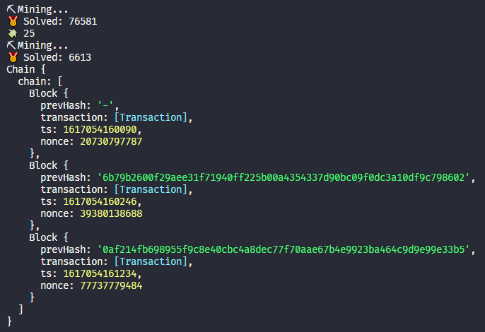

# Blockchain Example

Simple projet based on [Bitcoin ₿ in 100 Seconds // Build your Own Blockchain](https://www.youtube.com/watch?v=qF7dkrce-mQ) video from Fireship



## :page_with_curl: Requirements and Instalation

- NodeJs v15

```bash
#Clone this repository
$ git clone https://github.com/saviollage/simpleBlockchain

# Enter Directory:
$ cd simpleBlockchain

# Install the dependencies:
$ npm ci

# Running app:
$ npm start

```

## :pencil: Edit

Feel free to edit this basic implementation an then see how the chain works

```ts
// Basic implementation

const savio = new Wallet();
const satoshi = new Wallet();

satoshi.sendMoney(50, savio.publicKey);
savio.sendMoney(25, satoshi.publicKey);

console.log(Chain.instance);
```
